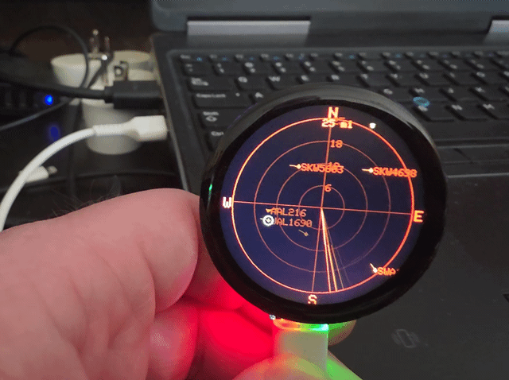

# TheMakersSpace Flight Radar

A portable ESP32-based flight tracking display that connects to your ADS-B receiver and shows nearby aircraft on a touchscreen display. Perfect for aviation enthusiasts, makerspaces, or anyone who wants a dedicated aircraft monitoring station.

## Features

- **Real-time Aircraft Tracking**: Displays nearby aircraft with callsign, distance, altitude, and speed
- **Multiple Unit Systems**: Choose between Native (knots/nautical miles), Imperial (mph/miles), or Metric (km/h/kilometers)
- **Interactive Touchscreen**: Tap aircraft to view detailed flight information
- **Auto-Rotation**: Built-in IMU detects orientation changes and rotates the display automatically
- **Shake-to-Wake**: Motion detection wakes the display from sleep mode
- **Audio Alerts**: Optional audio notifications for nearby aircraft
- **Demo Mode**: Simulated aircraft for testing and demonstration
- **Web Configuration**: Easy setup via built-in web portal
- **Daylight Saving Time**: Automatic DST adjustment option
- **Adjustable Range**: Monitor aircraft from 10 to 100+ miles away

## Hardware Requirements

### Recommended Board

- **[Waveshare ESP32-S3-Touch-LCD-1.46C](https://docs.waveshare.com/ESP32-S3-Touch-LCD-1.46)** (SKU 33837)
  - ESP32-S3 with 8MB PSRAM
  - 1.46" round LCD (412×412, SPD2010 QSPI controller)
  - Integrated touch, IMU, RTC, and audio DAC
  - Onboard I/O expander and battery management

**Purchase:** ~$25-35 from Waveshare (AliExpress/Digi-Key/Mouser) or [Amazon](https://www.amazon.com/dp/B0DS83H2V6?&linkCode=ll2&tag=commputethis-20&linkId=390bd2e4dff3d610c7e1b4d176fbe28e&language=en_US&ref_=as_li_ss_tl)

### Using Different Hardware

This project uses a hardware abstraction layer in `board_config.h`. To add support for a different ESP32 board + display, add a new `#elif defined(BOARD_YOURNAME)` block with your pin definitions. See `board_config.h` for details.

### What You'll Need for Class

- Waveshare ESP32-S3-Touch-LCD-1.46C board
- USB-C data cable (not charge-only)
- Computer with Arduino IDE installed
- WiFi network access
- (Optional) 3D printed case - see [Case Assembly Guide](docs/Case_Assembly.md)

### Currently Supported

- **Waveshare ESP32-S3-Touch-LCD-1.46C** (SKU 33837)
  - Documentation [(https://docs.waveshare.com/ESP32-S3-Touch-LCD-1.46)](https://docs.waveshare.com/ESP32-S3-Touch-LCD-1.46)

### Adding Other Boards

This project uses a hardware abstraction layer in `board_config.h`. To add support for a different ESP32 board + display:

1. Add a new `#elif defined(BOARD_YOURBOARD)` block in `board_config.h`
2. Define pins for your specific hardware
3. Select your board with `#define BOARD_YOURBOARD` at the top of `board_config.h`

The core code (FlightRadar.ino) remains unchanged - only pin definitions differ.

## Software Setup

### Prerequisites

- Arduino IDE or PlatformIO
- ESP32 board support package
- Required libraries:
  - Arduino_GFX
  - ArduinoJson
  - QMI8658 (for IMU support)
  - Preferences (built-in)

### Installation

Follow the [Build Guide](./docs/Build_Guide.md) to:

1. Download the code from GitHub
2. Install Arduino IDE, board support, and libraries
3. Configure board settings and upload
4. Verify the display shows "SETUP"

## Configuration

### First Boot

On first boot, the device creates a WiFi access point named **"FlightRadar-Setup"**. Connect to it and navigate to `192.168.4.1` to configure:

- **WiFi Credentials**: Connect to your network
- **ADS-B Receiver URL**: IP address of your dump1090/readsb instance
- **Timezone**: UTC offset for local time display
- **DST**: Enable daylight saving time observation
- **Units**: Native (nm/kt), Miles (mi/mph), or Metric (km/km/h)
- **Range**: Detection radius (10-100+ miles)
- **Audio**: Enable/disable audio alerts

### ADS-B Receiver Setup

This project requires a running ADS-B receiver with a JSON API endpoint. Compatible receivers include:

- **dump1090-fa** (FlightAware)
- **readsb** (Mode S decoder)
- **tar1090**

Ensure your receiver exposes the `/data/aircraft.json` endpoint and is accessible on your network.

## Usage

### Main Display

The main screen shows a scrollable list of nearby aircraft with:

- **Callsign**: Flight identifier (or ICAO hex if unknown)
- **Distance**: From your location
- **Altitude**: In feet
- **Speed**:    In knots, mph, or km/h depending on settings

### Aircraft Details

Tap any aircraft to view detailed information:

- Full flight details
- Aircraft type (if known)
- Heading and vertical speed
- Last seen timestamp

### Settings Menu

Access the settings menu by long pressing on the screen:

- **Theme**: Toggle between Green Phosphor and Amber CRT modes
- **Range**: Change detection radius
- **Units**: Switch between Native/Miles/Metric
- **Time**: Switch clock between 12h and 24h format
- **Audio**: Toggle audio alerts
- **Demo**: Enable demo mode with simulated aircraft
- **Brightness**: Adjust screen backlight
- **Log**: Enable SD card logging (if equipped)
- **DST**: Toggle daylight saving time

### Motion Controls

- **Shake**: Wake display from sleep
- **Rotate**: Auto-rotate display orientation (if IMU enabled)

## Troubleshooting

### Display stays blank

- Check backlight pin connection
- Verify TFT driver matches your display (ILI9341, ST7789, etc.)

### No aircraft showing

- Verify ADS-B receiver URL in settings
- Try increasing range in settings

### Crash/Restart loop

- May indicate insufficient RAM - try reducing `ADSB_MAX_AIRCRAFT` in config
- Check serial monitor for errors
- Ensure power supply can deliver sufficient current (500mA+)

### Touch not working

- Verify touch controller matches your display (SPD2010)
- Check touch CS and IRQ pin connections

## Advanced Configuration

### Custom Aircraft Database

Edit `aircraft_types.h` to add more types of aircraft

### API Endpoints (future add)

The web interface exposes these endpoints:

- `/` - Main configuration portal
- `/api/aircraft` - Current aircraft list (JSON)
- `/api/stats` - Statistics (JSON)
- `/api/toggle` - Toggle settings remotely

## Contributing

Contributions welcome! Please submit pull requests or open issues for:

- Bug fixes
- New features
- Documentation improvements
- Hardware compatibility reports

## License

AGPL-3.0 License - See LICENSE file for details

## Acknowledgments

- dump1090/readsb developers for the excellent ADS-B decoder
- Arduino community for the extensive libraries
- FlightAware and ADS-B Exchange for aircraft database references

---

**Happy plane spotting!** ✈️
